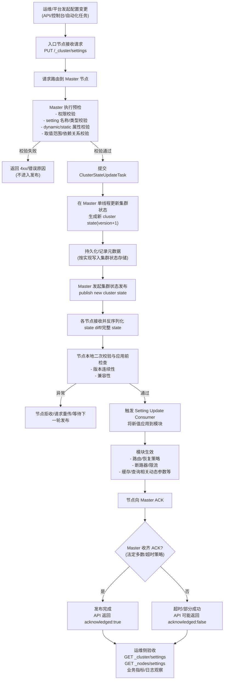
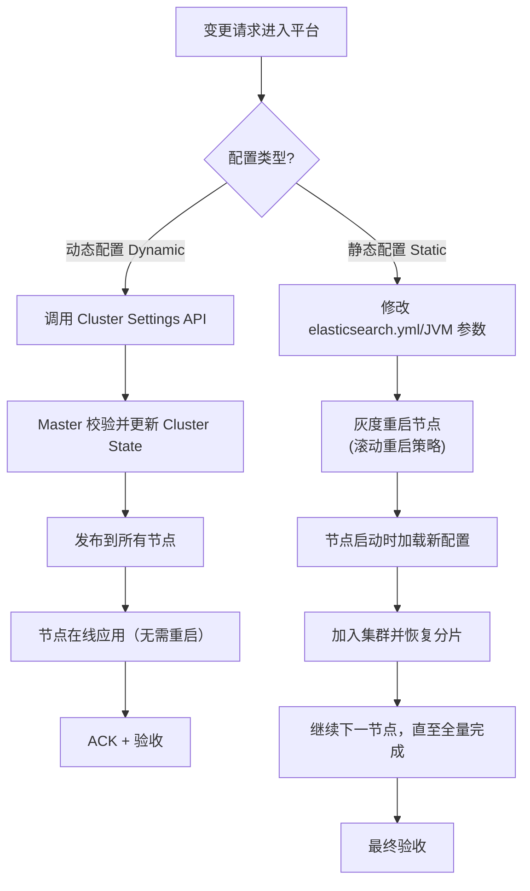
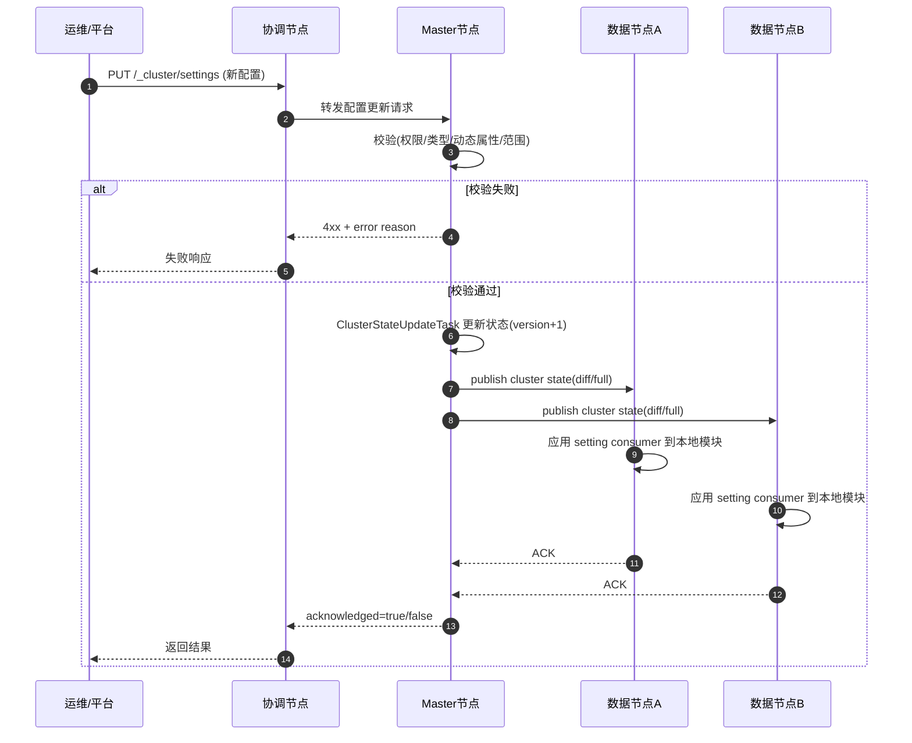

# Elasticsearch 配置下发流程（从“改配置”到“各节点生效”）

本文描述 Elasticsearch 集群配置从发起变更到节点生效的端到端流程，重点覆盖动态配置（`/_cluster/settings`）的下发链路，并补充静态配置的差异。

## 1. 端到端主流程图

## 2. 动态配置与静态配置分支

## 3. 关键时序图

## 4. 关键节点说明

- **校验阶段（Master）**：决定“能不能改”，常见失败包括参数拼写错误、类型不匹配、配置不支持动态更新。
- **Cluster State 更新**：决定“改了什么”，成功变更会形成新的状态版本。
- **发布阶段（Publish）**：决定“怎么下发”，Master 向各节点广播新状态（增量或全量）。
- **应用阶段（Consumer）**：决定“哪里生效”，节点通过对应模块的更新回调应用新配置。
- **ACK 与验收**：决定“是否形成闭环”，需结合 API 返回、节点视角和业务指标共同确认。

## 5. 变更与验收建议

1. 变更前确认目标参数是否为动态配置。
2. 变更后执行：
   - `GET /_cluster/settings?include_defaults=true`
   - `GET /_nodes/settings`
3. 观察关键日志与指标（延迟、拒绝率、恢复速度、资源利用率）。
4. 大集群采用分批灰度策略，避免一次性全量变更。
5. 每次变更保留回滚值，出现异常时快速恢复。
